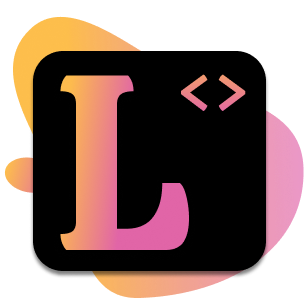
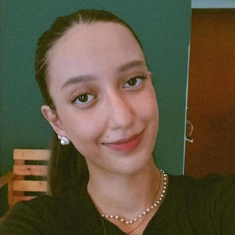

<!-- Adicione Badges das tecnologias que você usou aqui -->
<!-- Você pode encontrar badges aqui: https://github.com/Ileriayo/markdown-badges?tab=readme-ov-file#markdown-badges -->

**Este projeto foi desenvolvido como atividade final do curso de capacitação em Python da Cyber Edux, realizado de setembro de 2023 até março de 2024. Para mais informações, consulte o [enunciado](ENUNCIADO.md).**

Lovelace - plataforma de cursos 

<!-- Substitua a seguinte imagem por uma logo do seu projeto -->

<!-- Substitua o seguinte parágrafo por um resumo do seu projeto: -->
Lovelace é uma plataforma educacional que visa democratizar o acesso ao conhecimento em programação e desenvolvimento web. Oferecemos uma gama de cursos online. Nosso compromisso é proporcionar uma experiência de aprendizado dinâmica e envolvente, capacitando os alunos a adquirir habilidades essenciais para se destacar em um mercado de trabalho cada vez mais competitivo e em constante evolução. 

## Documentação

* [Documentação (para desenvolvedores)](DOCUMENTACAO.md)
* [Manual (para usuários)](MANUAL.md)

## Sobre o autor

<!-- Coloque seu nome, uma foto sua e uma pequena bio sobre você na seguinte tabela: -->
|  |  |
|:-------------:|:------------------------------------------------------------:|
|    **Maria Fernanda Morais Castro** | Estudante de Ciência da Computação |
